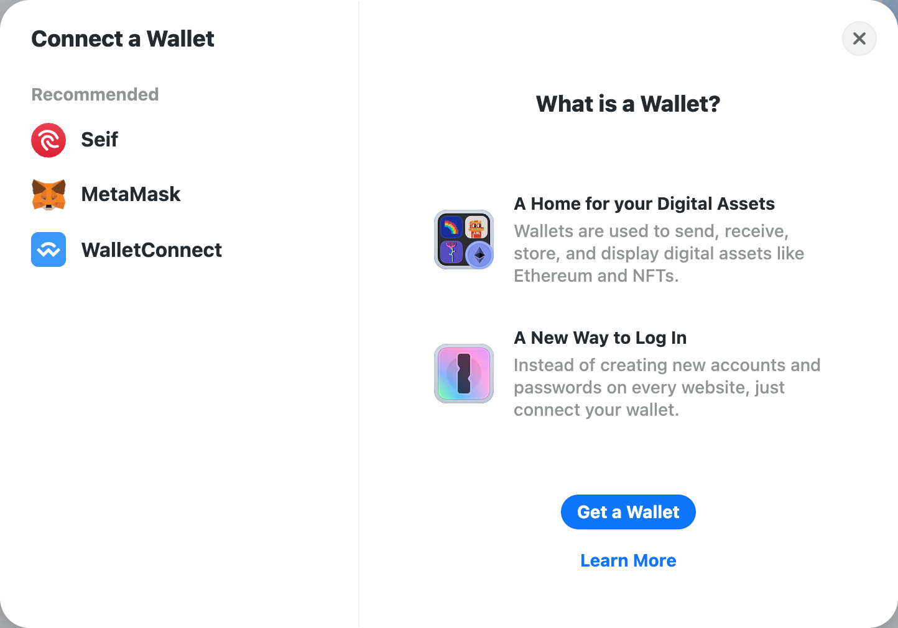

# seif-integration-sample

[Please refer to the attached file link.](https://github.com/HAECHI-LABS/seif-integration-sample/blob/main/src/app/providers.tsx)

[Download Seif Extension](https://chromewebstore.google.com/detail/seif/albakdmmdafeafbehmcpoejenbeojejl)

# Caution

To develop a dApp on a local PC, you must use an HTTPS certificate for the Seif Wallet integration. For the security reasons, window is not injected with window.\_\_seif instance in an insecure connection cases, which might occur a problem when connecting to a provider.

If you are using Next.js, please refer to the following link:
https://vercel.com/guides/access-nextjs-localhost-https-certificate-self-signed#enabling-https-for-local-development

If you are developing with Create React App, please refer to the link below:
https://create-react-app.dev/docs/using-https-in-development/

If you are using the Vite bundler, please refer to the link below:
https://vitejs.dev/config/server-options#server-https
